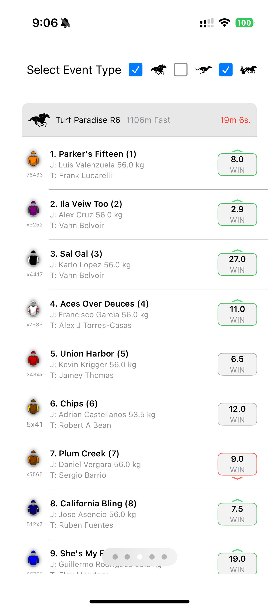
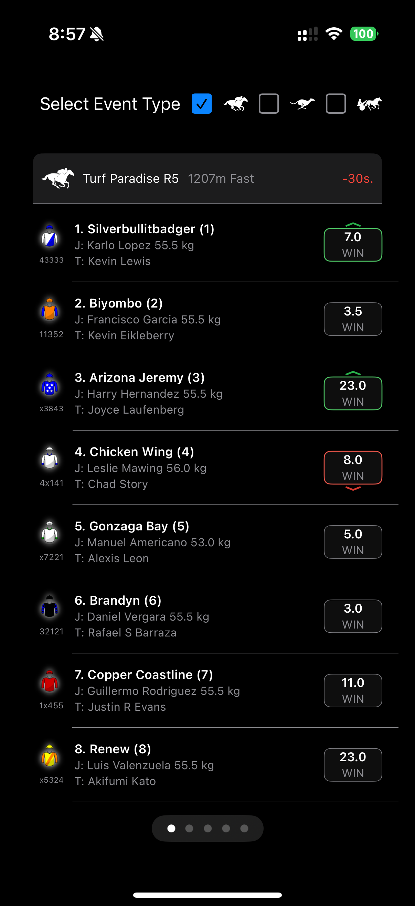
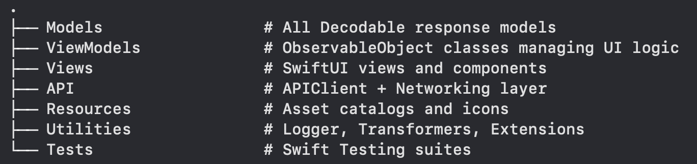
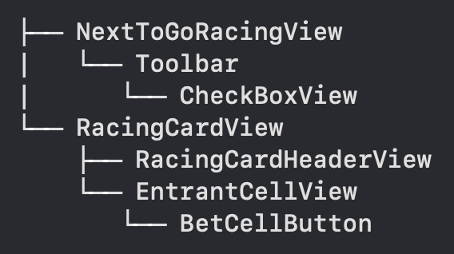
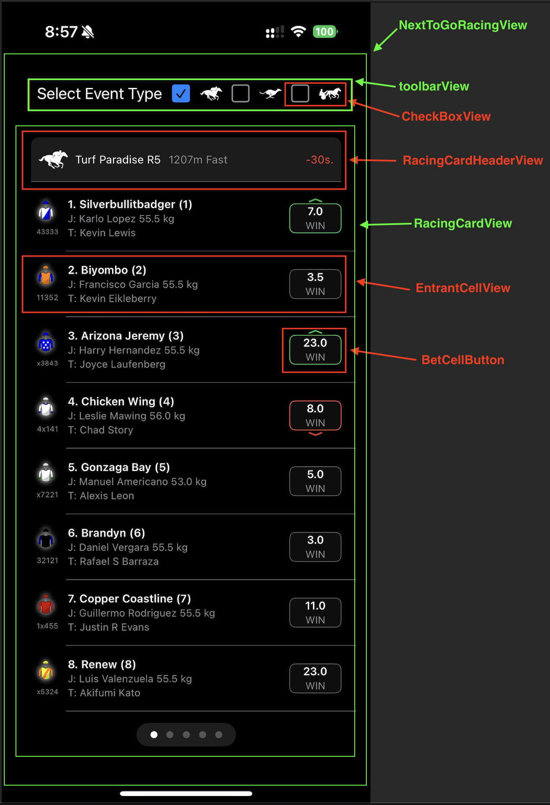

# 🏇 NextToGo

NextToGo is a SwiftUI-based iOS application for showcasing real-time upcoming racing events (Horse, Harness, Greyhound) using the Neds Racing API. It features polling, category filtering, accessibility enhancements, and a polished card-based UI.

---

## 📸 Screenshots

| Light Mode | Dark Mode |
|------------------|--------------|
|  |  |

---

## ✨ Features

- 🚀 **Async/Await-based Networking**
- 📦 Modular **MVVM architecture**
- 🧠 **Smart polling** using `Task` and `sleep`
- ✅ **Filtering** by race category (horse, harness, greyhound)
- 🎯 **SwiftUI** native layout and animations
- 🔄 **Live price changes** with chevron indicators
- 🧪 **Modern Swift Testing Framework**
- 🔒 **Concurrency-safe task management**
- ♿️ **Accessibility labels** and voiceover-friendly design
- 🌗 **Dark mode** support

---

## 🧱 Architecture
| Architecture |
|------------------|
| |

- ✅ Follows **MVVM**
- ✅ Uses `@MainActor` view models
- ✅ Separates transformation and networking

---

##Views
| Views Heirachy | Views |
|------------------|--------------|
|  |  |

---

🧠 Swift 6 Compatibility

NextToGo is built using Swift 6, embracing modern concurrency and safety improvements introduced in the language.

✅ Swift 6 Highlights Used
    •    @MainActor annotations for safe UI-bound view models
    •    actor for protecting shared mutable state (e.g. PollingTaskManager)
    •    Task {} and Task.sleep(nanoseconds:) for polling and async workflows
    •    #expect and @Suite from the Swift Testing framework for expressive tests

⸻

🔒 Swift 6 Strict Concurrency Enabled

This project enables Swift 6 Strict Concurrency Mode, which ensures thread-safe use of shared mutable state at compile time.

Key benefits:
    •    Prevents race conditions by design
    •    Enforces Sendable conformance where needed
    •    Guards against accidental use of @MainActor-isolated properties from background threads
    •    Highlights use of non-isolated shared state (e.g. global statics)
 
⸻

## 🔁 Polling Mechanism

- Uses a concurrency-safe `PollingTaskManager` actor
- Injected into view models for controlled task lifecycle
- Delays calculated to avoid spamming API requests
- Easily mockable via protocol (`PollingTaskManaging`)

---

♿️ Accessibility

Accessibility is thoughtfully integrated to provide an inclusive and intuitive experience for VoiceOver users and others relying on assistive technologies.
    ✅ Entrant Cell Accessibility
    •    Each entrant is fully described using a detailed accessibilityLabel.
    •    VoiceOver reads: runner number, name, barrier, jockey, trainer, and win price.
    •    Double-tap on a focused entrant cell automatically activates the bet button, making it quick and intuitive to place a bet.
    🔊 Live Price Change Announcements
    •    If the price changes and a cell is currently focused with VoiceOver, a live UIAccessibility.post(notification:) announcement is triggered to alert the user.
    •    Example: “Runner 7, Win Price has increased to $4.20”
    📣 Other Accessibility Improvements
    •    Every racing card header is labeled with countdowns and resource types (horse, greyhound, harness).
    •    Countdown timers are announced with readable units (e.g., “2 minutes 15 seconds”).
    •    Iconography uses .accessibilityHidden(true) where applicable to avoid cluttering announcements.
    •    Buttons and toggles are described with action labels (e.g., “Select Horse Racing toggle, selected”).

https://github.com/user-attachments/assets/5f11e928-7594-458a-a39b-0c88296a76d4

---

3. Run on a simulator or device.
Minimum Requirement: iOS 16+
Language Mode: Swift 6
Best experiance on real device 

🧪 Testing
This project uses the new Swift Testing framework.
To run all tests:
swift test

Includes test coverage for:
    •    API client
    •    ViewModels (NextToGoRacingViewModel, RacingCardViewModel, etc.)
    •    Image resource generation
    •    Polling task management (including spy & mock)

 🧩 Dependencies
    •    None

 
